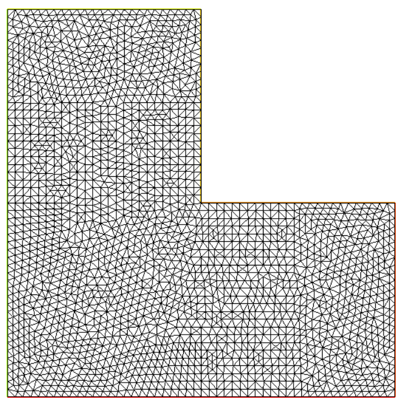

## Mixed Precision ParaDiag Test Case
* Test example:
    * Equation: ($\nu=10e-3$)
    $$
    \dot{ u}(x, y,t) - \nu\Delta u(x, y,t) +  \left(u_x(x,y,t) + u_y(x, y, t)\right) = 0, \quad (x, y)\in (-\frac12,\frac12)\times(-\frac12,\frac12), t\in(0, T)
    $$
    * Boundary conditions and initial conditions
    $$
        u(\pm\frac12, y, t) = 0,\quad  u(x, y, 0) = x^2\sin(2\pi x)y^2\cos(2\pi y), \quad \dot{ u}(x, y, 0) = 0.
    $$
    * Spatial discretization matrix form
    $$
        \bm M\dot{\bm d} + (\nu\bm K - \bm C)\bm d = \bm 0
    $$

    $$
    \bm M = \sum^{e}_{i=0}\bm N_i^T\bm N_i,\quad \bm K = \sum^e_{i=0}\bm B^T_i\bm B_i,\quad \bm C= \sum^e_{i=0}\bm N^T_i\bm n\bm B_i
    $$

    * Geometric structure
    * Geometric structure  
    {:width="300" height="200"}
    

* This code involves multi-GPU parallel computing: CUDA for GPU parallelism implementing ParaDiag parallel solving, MPI for multi-GPU scheduling. Test cases include: Unified double precision (D_D), single-double mixed precision (S_D), unified single precision (S_S), half-double mixed precision (H_D), half-single mixed precision (H_S), corresponding to folders: D_D, S_D, S_S, H_D, H_S

* Test case folders contain (taking D_D as example):
  * Eigen library folder: Eigen
  * Input folder: Input
    * d0.txt Initial condition $\bm u(x, y, 0)$
    * dt0.txt Initial condition $\dot{\bm u}(x, y, 0)$
    * F.txt Right-hand term
    * Mass.txt Matrix $\bm M$
    * Stiff.txt Matrix $\bm K$ 
    * mesh.txt Mesh data file
    * a_b.txt Eigenvalue input file
  * main.cpp Main program, MPI initialization, calling other files for ParaDiag computation
  * Input_Data.h Data reading
  * Generate_Random.h Computing reference solutions, updating ParaDiag iteration vectors, calculating residuals
  * lu_gpu.cuh, lu_gpu.cu Implementing GPU-parallel ParaDiag solving, using block-wise parallel LU decomposition as solver

  

* Program compilation: The program involves fftw3 library, Eigen library, OpenBLAS library and cublas library, with MPI environment. Required to add corresponding library paths during compilation, using nvcc for compilation.